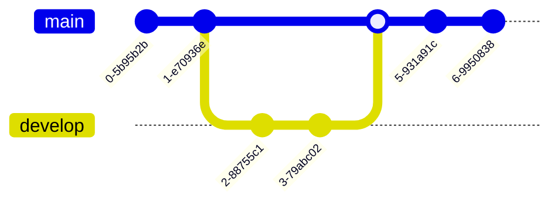

<i>{{ page.excerpt }}</i>



Here is a deep dive into how you can define custom commands for Git to use.

I've stored several examples in a <strong>git-custom-commands</strong> folder within my repo.

   <pre>
   <a target="_blank" href="https://github.com/wilsonmar/git-utilities">https://github.com/wilsonmar/git-utilities</a>
   </pre>

0. Fork it so you can make changes and add more files of your own.

0. Get my repo onto your machine using a Git UI or in a Git command line:

   <pre><strong>
   git clone <a target="_blank" href="https://github.com/wilsonmar/git-utilities">https://github.com/wilsonmar/git-utilities</a>
   </strong></pre>

   ### On a Mac:

0. cd into the repo.

   <pre><strong>
   cd git-custom-commands
   </strong></pre>

   The contents of this folder needs to be within the path where the operating system searches for programs and scripts.

0. Optionally, create a folder on the operating system's path
   by copying the <strong>git-custom-commands</strong> folder from within the Git repository
   into a folder in your home directory.

   Creating your own folder enables you to add more files to that.

   <pre>
   cd $HOME
   mkdir git-custom-commands
   </pre>

   Linux people often use <tt>/opt/bin</tt>, but on a Mac that is a protected area requiring sudo access.

0. Switch to a text editor to edit file <strong>~/.bash_profile</strong>.
   For example, to use Sublime Text:

   <pre>
   subl ~/.bash_profile
   </pre>

0. At the bottom or wherever, ADD the path to your git-custom-command files.

   PROTIP: Git automatically make files available as a subcommand, just like regular executable scripts.

   An example of referencing where I cloned:

   <pre><strong>
export PATH="$HOME/gits/wilsonmar/git-utilities/git-custom-commands:$PATH"
   </strong></pre>

   This adds the folder to the front of the PATH.

0. View the PATH:

   <pre>
   echo $PATH
   </pre>

0. So the changes "take", exit terminal session windows or re-run Terminal initialization:

   <pre>
   source ~/.bash_profile
   </pre>

0. cd into the git-custom-commands folder.

0. Set permissions to execute each file:

   <pre><strong>
   chmod 555 *
   </strong></pre>

0. Skip to <a href="#TryEcho"> Try Git Echo</a> below.

   ### On Windows:

0. If you haven't already, install Chocolatey, then

   <pre><strong>
   choco install mysysgit
   </strong></pre>

0. Look for the libeexec\git-core folder:

   <pre><strong>
   cd /
   dir git-core /s
   </strong></pre>

   What I see:

   <pre>
 Directory of C:\Program Files\Git\mingw64\libexec
&nbsp;
04/21/2016  11:09 AM    &LT;DIR>          git-core
               0 File(s)              0 bytes
&nbsp;
 Directory of C:\Program Files\Git\mingw64\share
&nbsp;
04/21/2016  11:09 AM    &LT;DIR>          git-core
               0 File(s)              0 bytes
   </pre>

0. cd into the folder:

   <pre>
C:\Program Files\Git\mingw64\libexec\git-core
   </pre>

   Older 32-bit machines would use:

   <pre>
C:\Program Files (x86)\Git\libexec\git-core
   </pre>

0. List files in git-core.

   Notice several files do not have an *.exe file extension:

   * git-bisect
   * git-cittool
   * git-cvsimport
   * git-cvsserver
   * git-difftool
   * git-gui
   * git-instaweb
   * git-merge-octopus
   * git-mergetool
   * git-rebase
   * git-request-pull
   * git-send-email
   * git-sh-setup
   * git-sh-i18n
   * git-stash
   * git-subtree
     

   PROTIP: The first line of these files define them as shell files which Git can process
   because Git executable on Windows has the bits to process shell files in sh.exe:

   <pre>
   start "" "%SYSTEMDRIVE%\Program Files (x86)\Git\bin\sh.exe" --login 
   start "" "%SYSTEMDRIVE%\Program Files\Git\bin\sh.exe" --login
   </pre>

0. Copy the contents of git-custom-commands into Git client's git-core folder found above:

   

   ### Try git echo

0. Try the command <strong>git-echo</strong>, created just so we can verify whether we have it working:

   <pre><strong>
   git echo "hello world"
   </strong></pre>

   You should see response:

   <pre>
   hello world
   </pre>

   Instead of "hello world", you can type in any phrase. Double quotes are not necessary if you only type one word.

   PROTIP: The git echo command is handled by a file named <strong>git-echo</strong>,
   which has NO file extension (such as .sh). 
   Git knows to add the dash in the name when it looks for a custom command.

   The $1 is the place-holder for the message typed into the command.

   ## Try git c "message"

The git-c custom command is the equivalent to typing this:

   <pre>
git add -A
git commit -m '@mac: message in command line'
   </pre>

   The command to invoke it:

   <tt><strong>
git c "message in command line"
   </strong></tt>

   A sample response:

   <tt><strong>
[master 181b537] @mac: message in command line
 1 file changed, 0 insertions(+), 0 deletions(-)
 create mode 100644 4
   </strong></tt>

   The underlying code:

   <tt><strong>
git add -A
git commit --message="@${PWD##*/} $1"
   </strong></tt>

   The weird set of characters in the commit line 
   produces the Present Working Directory (PWD).

   It is not really needed to add the username because

   Troubleshoot your path if you see this error message:

   <pre>
git: 'c' is not a git command. See 'git --help'.
&nbsp;
Did you mean one of these?
        checkout
        clone
        commit
        gc
   </pre>   

### View log

View the messages:

   <tt>
git log --oneline
   </tt>

### Graphviz

Seth House did several videos on Git and GitHub, in which he showed use of a utility to create a visualization
from the command line. He was nice enough to share it with me.

0. Install GraphViz using a package manager. On a Mac:

   <pre><strong>
   brew install graphviz
   </strong></pre>

   This installs dependencies libtiff, webp, gd

   * http://www.graphviz.org/Download_macos.php - graphviz-2.40.1.pkg
   * http://www.graphviz.org/Download_windows.php
     

0. Save the file from a text editor into folder 

   Alternately, copy the file graph-dag into that folder from the cloned folder.

0. Set permissions to execute the file:

   <pre><strong>
   chmod a+x graph-dag
   </strong></pre>

0. Run the graph-dag that outputs a commit graph using the GraphViz "dot" tool:

   <pre><strong>
   git graph-dag HEAD~10.. | dot -Tpng > mygraph.png
   </strong></pre>

0. Additionally, look at the other utilities at:

   https://git.wiki.kernel.org/index.php/ExampleScripts

   * Sorting commits by commit message line count / changed lines ratio
   * Copying all changed files from the last N commits
   * Setting the timestamps of the files to the commit timestamp of the commit which last touched them

## Visualization of branches

git log does a good job of illustrating branches,
but GitKraken provides this colorful branch graphics:

   * The master branch is the light-blue line on the left.

   * The Bug fix branch is the darker-blue line to the right of that.

   * The develop branch is the purple line to the right of that.

### ASCII Art

Make some ASCII art from (part of your) history

<pre>
A - B - C
  \       \
    D - E - F
</pre>

### Flowchart using Mermaid.js

Text like this within GitHub Markdown (used by Azure DevOps project Wikis, GitLab, Notion, Obsidian):
<pre>
graph TD;
    A[Start] --> B(Process Input);
    B --> C{Check Status?};
    C -- Yes --> D[Finish];
    C -- No --> B;
</pre>
or created using <a target="_blank" href="https://mermaid.live/edit">an online editor</a> 
are read by <a target="_blank" href="https://en.wikipedia.org/wiki/Mermaid_(software)">Mermaid.js</a> (open sourced at <a target="_blank" href="https://github.com/mermaid-js/mermaid">https://github.com/mermaid-js/mermaid</a>) to produce <a target="_blank" href="https://github.com/mermaid-js/mermaid?tab=readme-ov-file#git-graph-experimental---live-editor">Git graphs</a> like this:

BTW Like Graphviz, Mermaid draws 
<a target="_blank" href="https://github.com/mermaid-js/mermaid?tab=readme-ov-file#flowchart-docs---live-editor">Flowcharts</a>,
<a target="_blank" href="https://github.com/mermaid-js/mermaid?tab=readme-ov-file#gantt-chart-docs---live-editor">Gantt charts</a>,
<a target="_blank" href="https://github.com/mermaid-js/mermaid?tab=readme-ov-file#bar-chart-using-gantt-chart-docs---live-editor">Bar charts</a>,
<a target="_blank" href="https://github.com/mermaid-js/mermaid?tab=readme-ov-file#user-journey-diagram-docs---live-editor">User Journey diagrams</a>,
<a target="_blank" href="https://github.com/mermaid-js/mermaid?tab=readme-ov-file#pie-chart-docs---live-editor">Pie charts</a>,
UML:
<a target="_blank" href="https://github.com/mermaid-js/mermaid?tab=readme-ov-file#sequence-diagram-docs---live-editor">Sequence Diagrams</a>,
<a target="_blank" href="https://github.com/mermaid-js/mermaid?tab=readme-ov-file#class-diagram-docs---live-editor">Class diagrams</a>,
<a target="_blank" href="https://github.com/mermaid-js/mermaid?tab=readme-ov-file#state-diagram-docs---live-editor">State diagrams</a>,

<a target="_blank" href="https://github.com/mermaid-js/mermaid?tab=readme-ov-file#c4-diagram-docs">C4 diagrams</a> (Context, Container, Component, and Code).
The four levels of C4 diagrams:

* Context Diagram: This is the highest-level overview, showing the entire software system as a single box and its interactions with people and other systems. It helps define the system's scope and external integrations.

* Container Diagram: This level zooms into the system and shows its containers (like a web application, mobile app, database, or microservice) and how they communicate with each other.

* Component Diagram: This diagram drills down into a single container, detailing the components inside it and their interactions. For example, a web application container might be broken down into components for user authentication and account management.

* Code Diagram: This is the most detailed level, showing the implementation details of a single component, often using a traditional UML class diagram or similar notation. 

## Resources

* http://mfranc.com/tools/git-custom-command/

## More #

This is one of a series on Git and GitHub:


