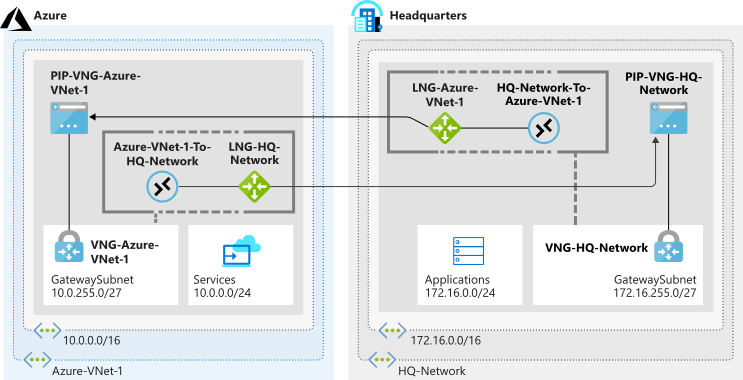

<i>{{ page.excerpt }}</i>



STATUS: This is currently actively being edited.



Here are the notes on Networking I took while studying for <a target="_blank" href="https://wilsonmar.github.io/azure-certifications/">Azure certification exams</a>, specifically the  
<a target="_blank" href="https://docs.microsoft.com/en-us/learn/certifications/exams/az-700">exam AZ-700 "Designing and Implementing Microsoft Azure Networking Solutions</a> available in July 2021 to become a <a target="_blank" href="https://docs.microsoft.com/en-us/learn/certifications/azure-network-engineer-associate/">Azure Network Engineer</a>. SKills:

   * Design, Implement, and Manage Hybrid Networking (10% to 15%)
   * Design and Implement Core Networking Infrastructure (20% to 25%)
   * Design and Implement Routing (25% to 30%)
   * Secure and Monitor Networks (15% to 20%)
   * Design and Implement Private Access to Azure Services (10% to 15%)
     

https://github.com/ElYusubov/AWESOME-Azure-Bicep

https://github.com/HoussemDellai/azure-bicep-course

https://www.thomasmaurer.ch/2021/06/az-700-study-guide-microsoft-azure-networking-solutions

## Planning

PROTIP: Plan out your network typology ahead of time to define names of resources in a diagram such as this:

<a target="_blank" href="https://learning.oreilly.com/attend/exam-az-303-microsoft-azure-architect-technologies-crash-course/0636920452881/0636920053523/">
Tim Warner's 6 hr Live AZ-303 cert class on OReilly</a> teaches to his <a target="_blank" href="https://github.com/timothywarner/az303">GitHub repo</a> which includes a <a target="_blank" title="warner-azure-frankenstein-V2-793x629" href="https://user-images.githubusercontent.com/300046/114078765-904d4000-9866-11eb-80a0-dc017198cf3d.png">this full diagram: 
</a>

## Hands-on start here

This page assumes you've absorbed <a target="_blank" href="https://wilsonmar.github.io/azure-onboarding/">my Azure onboarding instructions</a> for skill at Portal GUI and CLI.

1. In the Portal GUI, G+\ to Search for "Net" and there appears:

   * <a href="#NetworkInterfaces">Network interfaces</a>
   * <a href="#Watcher">Network Watcher</a>
   * Network security groups
   * Network security groups (classic)
   * <a href="#VirtualNetworks">Virtual networks <strong>(vNets)</strong></a>
   * Local network gateways
   * Virtual network gateways
   * Virtual networks (classic)
     

### Hub-and-spoke

Use less code to define Hub-and-spoke by using <a target="_blank" href="https://github.com/lukeorellana/terraform-on-azure/blob/main/06-advanced-hcl/06-for-each-with-for/main.tf">for_each Terraform code</a> explained in <a target="_blank" href="https://www.udemy.com/course/terraform-on-azure-2021/learn/lecture/25583436#overview">chapter 37</a> of the <a target="_blank" href="https://www.udemy.com/course/terraform-on-azure-2021/">1.5 hr Udemy video course: Terraform on Azure 2021</a> by <a target="_blank" href="https://www.linkedin.com/in/luke-orellana/">Luke Orellana</a> under Mike Pfiffer's CloudSkills.io.

https://github.com/nicolgit/hub-and-spoke-playground
provides <strong>Deployment Stacks</strong>
A collection of BICEP/ARM templates that deploys on Azure a hub & spoke net topology aligned with Microsoft Enterprise scale landing zone ref architecture to use as playground for test and study. As bonus many scenarios with step-by-step solutions for studying and learning are also available

## VNets (Virtual Networks)

Create a VNet with a name for specification when a VM is created later.

1. Get to <a target="_blank" href="https://portal.azure.com/#blade/HubsExtension/BrowseResource/resourceType/Microsoft.Network%2FvirtualNetworks">Virtual Networks</a> by pressing G+\ to cursor to the Search bar, then type enough to select the service when it appears in the drop-down.

   "Create a virtual network to securely connect your Azure resources to each other."

1. Click "+ Create".

   Azure Virtual Network (abbreviated <strong>"VNets"</strong>) is the fundamental building block for your private network in Azure. VNet enables many types of Azure resources, such as Azure Virtual Machines (VM), to securely communicate with each other, the internet, and on-premises networks. VNet is similar to a traditional network that you'd operate in your own data center, but brings with it additional benefits of Azure's infrastructure such as scale, availability, and isolation.

   VNets define the communications and security boundaries that enable Azure resources to communicate with each other securely. VNets are the basic building blocks for securely isolating resources such as load balancers, virtual machines, etc.

1. Subscription:

   LIMIT: 50-100 VNets are allowed per Azure Subscription.

1. Resource Group:

1. VNet Name: Naming Convention: PROTIP: Include the environment and <strong>region</strong> in the VNet name because a VNet controls network access within a single region/location. Include a zero-padded number in case several are needed. Example:

   <tt>prod-eastus-vnet01</tt>

1. Region:

1. Security tab:

   

   All resources in a VNet can communicate outbound to the internet, by default.

1. BastionHost: leave as Disable by default.

   Network Virtual Appliances (NVA) in the Azure Marketplace are specialized VMs that provide firewall, load balancing services. Service chaining across regions are less expensive than standing up 

1. <a href="#DDoS">DDoS Protection (see below)</a> Standard: <strong>Enable</strong>

1. Firewall: <strong>Enable</strong>

1. IP Addresses tab:

   Each VNet is created by specifying a custom private IP address space using public and private (RFC 1918) addresses. For example, to deploy a VM in a VNet address space, 10.0.0.0/16, the VM will be assigned a private IP such as 10.0.0.4. (CIDR blocks which do not overlap).

   A portion of the virtual network's address space is allocated to subnets to deploy Azure resources. 

   ### IP Address Ranges

   To logically subdivide addresses, the "host identifier" portion of an IP address.

   <table border="1" cellpadding="4" cellspacing="0">
   <tr><th> Host CIDR Range </th><th> Bits </th><th> Addresses </th></tr>
   <tr valign="top"><td> /16 </td><td> ? </td><td> 65,536 </td></tr>
   <tr valign="top"><td> /24 </td><td> ? </td><td> 256 </td></tr>
   <tr valign="top"><td> /32 </td><td> ? </td><td> ? </td></tr>
   </table>

The first 3 addresses Azure takes for its own.

Secure resources within subnets using Network Security Groups (NSGs).

Azure VNets manage User defined routes (UDR’s). 

   NOTE: Connect your virtual network to your on-premises network using an Azure VPN Gateway or <a href="#ExpressRoute">ExpressRoute (see below)</a>.

## Connection Verification: ICMP Ping

<a target="_blank" href="https://app.pluralsight.com/course-player?clipId=7843d3db-0955-424e-bc28-75e554168e32" title="Tim Warner">VIDEO</a>:
PROTIP: Azure blocks ICMP between VNets and the internet.

1. To enable ICMP pings on each VM, use this PowerShell command:

   <pre>Set-ExecutionPolicy -ExecutionPolicy Bypass -Force
New-NetFirewallRule -DisplayName 'Allow ICMPv4-In' -Protocol 'ICMPv4'
   </pre>

1. To check whether another VM can reach another VM:

   <pre>Enter-PSSession -ComputerName 10.20.20.4
ping -4 10.20.20.1
   </pre>

   ### TCPing.exe

   Because the ICMP protocol is usually blocked on servers to prevent network reconissance by malicous actors, probe servers using the TCP protocol by running "tcoping" from SysInternals.

1. <a target="_blank" href="https://app.pluralsight.com/course-player?clipId=0a254f0c-5467-400a-9b06-1eb0e37902df">VIDEO</a>:
      
   <pre>tcping.exe -p 3389 -n 8 10.20.20.1
   </pre>

1. Test access of domain name:
      
   <pre>tcping.exe -p 80 -w 9  whatever.com
   </pre>

1. Another PowerShell command:

   <pre>get-help -Name Test-NetConnection -Examples
   Test-NetConnection -ComputerName 10.20.20.1 -InformationLevel Detailed -TraceRoute 
   Test-NetConnection -ComputerName 10.20.20.1 -InformationLevel Detailed -CommonTCPPort RDP
   </pre>

## Networking with VMs

Define Networking when creating a Virtual Machine:

1. Define a VM, then specify it's networking:

   PROTIP: Define conventions for naming variables in PowerShell:

   <pre>$rgName = "TestGroup"
$myLocation = "eastus"
$vmName = "FileSystemTestVM"
$vnetName = "TestGroupVnet"
$subnetName = "default"
$nicName = "newnic"
&nbsp;
# Deallocate vm:
Stop-AzVM -Name $vmName -ResourceGroupName $rgName
&nbsp;
# Get VM config:
$vm = Get-AzVM -Name $vmName -ResourceGroupName $rgName
&nbsp;
# Create New VNet:
$myVnet = New-AzVirtualNetwork -AddressPrefix "10.20.0.0/16" `
   -Name $vmName -ResourceGroupName $rgName -Location $myLocation
&nbsp;
# Get info for backend subnet:
$myVnet = Get-AzVirtualNetwork -Name $vmName -ResourceGroupName $rgName
$backEnd = $myVnet.Subnets|?{A$_.Name -eq $subnetName}
   </pre>

The larger the AddressPrefix suffix /16 in "10.20.0.0/16" that smaller the subnet.

5 addresses in each subnet are reserved by Azure for overhead functionality.

## Virtual Networks resources

1. In the top Search field, type enough of <strong>Virtual network</strong> and press return to select the service. Its menu:

   * Address space
   * Connected devices
   * <a href="#Subnets">Subnets</a>
   * <a href="#DDoS">DDoS protection</a>
   * <a href="#Firewall">Firewall</a>
   * Security
   * <a href="#DNS">DNS servers</a>
   * <a href="#Peerings">Peerings</a>
   * <a href="#Endpoints">Service Endpoints</a>
   * <a href="#PrivateEndpoints">Private endpoints</a>
   * <a href="#Properties">Properties</a>
     

## Network Performance Monitor

1. In the Portal, click "+" at the upper-left corner for the Marketplace.
1. In Search, Type enough of "Network Performance Monitor" to select it.

   Notice it's from Solarwinds.

1. Click "Create".
1. Create Resource group.
1. Select choices to create a VM instance.

## Network interfaces

Within a particular Virtual Machine:

1. Network Interface

   * Overview
   * Activity log
   * Access control (IAM)
   * Tags

   * IP configurations
   * DNS servers
   * Network security group
   * Properties
   * Locks
   * Export template
     

Typically, because VMs are setup as a cluster behind a Load Balancer, most VMs do not accept traffic directly from the public internet.

## JIT

Many organizations prefer that a new instance be created with changed settings rather than mucking about in running servers.

Rather than defining a Network Security Group to expose a static IP address for RDP/SSH for administrative access, use JIT that opens ports for a limited time only when needed.

## Static Public IP Configuration

1. Before making it public, setup a Network Security Group (NSG) to protect the VM's network interface. Enable Windows Defender? You always get 3 inbound security rules by default:

   

   REMEMBER: Lower Priority numbers are the most urgent (more priority).

1. Click "IP configurations" within Network Interface within a particular VM.

1. Click on "ipconfig1", the default Name of the Primary Private IP (PIP) address created automatically.

1. Enable "Public IP address" for the "Choose public IP address" dialog. "+ Create New". Change the Name according to your Naming Conventions.

   "Assignment" (Dynamic or Static) apply only to Basic.

1. Click "Standard" (which costs extra) when working with Availability Zones.

   PROTIP: Unlike AWS, Azure doesn't give you a choice of Public IP address.

   Assignment: Dynamic is the default.

1. Select Assignment: Static and specify an IP address (such as 10.0.1.10)
1. Save!

   CAUTION: A reboot of the VM is necessary when the IP changes.

## Subnets

Subnets group

<table border="1" cellpadding="4" cellspacing="0">
<tr><th> Subnet Name </th><th> Address CIDR </th><th> IPv4 available addr. </th></tr>
<tr valign="top"><td> front   </td><td> 10.0.1.0/24 </td><td> 249 </td></tr>
<tr valign="top"><td> back    </td><td> 10.0.2.0/24 </td><td> 249 </td></tr>
<tr valign="top"><td> bastion </td><td> 10.0.3.0/24 </td><td> 250 </td></tr>
</table>

CIDR = Classless Inter-Domain Routing.

## VNet Peerings

<a target="_blank" href="https://app.pluralsight.com/course-player?clipId=3a9510f6-e9f9-4576-a9e6-3e4bc2522f34" title="by Tim Warner">VIDEO</a>:
* Connecting VNets in the same region is called <strong>Virtual Network Peering</strong>.
* Connecting VNets between separate regions (and Subscriptions) is called <strong>Global VNet Peering</strong>.
  

VNets in different regions can connect using either VPN gateways or Global Peering:

<table border="1" cellpadding="4" cellspacing="0">
<tr><th> Item </th><th> Global VNet Peering </th><th> VPN Gateways </th></tr>
<tr valign="top"><td> Privacy:
   </td><td> Routed through <strong>Microsoft's private backbone</strong>. No public internet involved
   </td><td> Public IP involved
   </td></tr>
<tr valign="top"><td> Pricing:
   </td><td> Ingress/Egress
   </td><td> Hourly + Egress
   </td></tr>
<tr valign="top"><td> Bandwidth limitations:
   </td><td> No bandwidth limitations
   </td><td> Varies based on SKU. See Gateway SKUs by tunnel, connection, and throughput
   </td></tr>
<tr valign="top"><td> Limit per virtual network:
   </td><td> Up to 500 virtual network peerings per virtual network
   </td><td> One VPN gateway per vNet. Max. tunnels per gateway based on the gateway's SKU
   </td></tr>

<tr valign="top"><td> Encryption:
   </td><td> Software-level encryption is recommended
   </td><td> Custom IPsec/IKE policy can be applied to new or existing connections.
   </td></tr>
<tr valign="top"><td> Advantages:
   </td><td> Data replication, database failover
   </td><td> Encryption takes time
   </td></tr>
<tr valign="top"><td> Disadvantages:
   </td><td> frequent backups of large amount of data
   </td><td> Lower latency and throughout
   </td></tr>
<tr valign="top"><td> Transitive (peer of peers)
   </td><td> Peering connections are non-transitive. But transitive networking can be achieved using NVAs or gateways in the hub virtual network. See Hub-spoke network topology for an example.
   </td><td> If virtual networks are connected via VPN gateways and BGP is enabled in the virtual network connections
   </td></tr>
<tr valign="top"><td> Initial setup time:
   </td><td> Few minutes
   </td><td> ~30 minutes
   </td></tr>
</table>

To peer virtual networks involving separate subscriptions in different Azure Active Directory tenants, the administrators of each subscription (both) must grant the peer subscription's administrator the <strong>Network Contributor role</strong> on their virtual network.

1. In a Virtual Network,
1. Click "Peerings" on the left menu.
1. In Peer details: virtual network deployment model: leave as default
   "Resource manager" (rather than "Classic").

1. In Configuration: Allow virtual network access: click "Enabled"

1. For "Allow forwarded traffic" leave blank

1. For "Allow gateway transit" leave blank

1. For "Use remote gateways" leave blank

## Azure Express Route on-prem networking

<a target="_blank" href="https://github.com/timothywarner/azure-arch-crash-course/blob/master/images/hub-spoke.png">*</a>

<a target="_blank" href="https://app.pluralsight.com/course-player?clipId=81b6ab57-edd1-4bd4-a32b-9d847466e13f">VIDEO</a>:
<strong>Azure ExpressRoute</strong> routes traffic through dedicated private connections between the on-premises network and Azure rather than going over the public internet. This achieves greater resilience, faster speeds, higher security, and lower latency. But it's considered expensive.

ExpressRoute can exist alongside current site-to-site, point-to-site, or VPN-to-VPN connections.

ExpressRoute must have a private connection provided by a connectivity partner in one of three ExpressRoute connectivity types:

   * The "CloudExchange co-location" method connects to Azure by using the Ethernet exchange provided by a co-location facility.

   * The "Any-to-any (IPVPN) Connection" method integrates a WAN with Azure by using an IP Virtual Private Network provider. This connection type links branch offices with datacenters. When it's enabled, the connection to Azure is similar to any other branch office that's connected via the WAN.

   * The "Point-to-point Ethernet Connection" method connects on-premises datacenters and offices to Azure through a point-to-point Ethernet link.

QUESTION:

* A <strong>Site-to-site VPN (S2S VPN)</strong> sends traffic between on-premises VPN devices and an Azure VPN Gateway deployed in a virtual network. This connection type enables any on-premises resources to access a virtual network through an <strong>encrypted tunnel</strong> through the public internet.

* A <strong>Point-to-site virtual private network (P2S VPN)</strong> sends traffic though an encrypted tunnel over the internet between a virtual network and a <strong>individual computer</strong> (point) in your network. This connection type is convenient during development because it requires little or no changes to the existing network. 

Connections through am on-premises network using an Azure VPN Gateway or ExpressRoute connection can propagate on-premises Border gateway protocol (BGP) routes to virtual networks.
Custom route tables can be created for each subnet to control where traffic is routed to.

Service endpoints allow service resources to be secured to the virtual network.

ExpressRoute bandwidth speeds come in fixed tiers shared across any peering in the circuit:
50 Mbps, 
100 Mbps, 
200 Mbps,
500 Mbps,
1 Gbps,
10 Gbps,
100 Gbps

ExpressRoute doesn't support the Hot Standby Router Protocol (HSRP). You'll need to enable a Border Gateway Protocol (BGP) configuration.

ExpressRoute uses network Layer 3 connectivity and security standards.
Operating on a Layer 3 circuit requires a network security appliance to manage threats.
To improve network security, ExpressRoute requires network security appliances between the provider's edge routers and your on-premises network.

Monitoring the connectivity between your on-premises network and Azure must use the <strong>Azure Connectivity Toolkit</strong>.

This <a target="_blank" href="https://github.com/mspnp/reference-architectures/tree/master/dmz/secure-vnet-hybrid">reference architecture</a> of a secure hybrid perimeter network which extends an on-premises network into Azure, in order to have granular control over traffic entering an Azure virtual network from an on-premises datacenter.

The gateway (in its own subnet) provides connectivity between routers in the on-premises network and the virtual network.

In the gateway subnet, traffic sent to the web-tier subnet (10.0.1.0/24) is routed through the Azure Firewall instance. All inbound and outbound traffic pass through Azure Firewall, a managed firewall as a service. The Firewall instance is placed in its own subnet.

Virtual network routes define the flow of IP traffic within the Azure virtual network. In the diagram shown above, there are two user-defined route tables.

In the web tier subnet, since there is no route for address space of the VNet itself to point to Azure firewall, web tier instances are able to communicate directly to each other, not via Azure Firewall.

Network security groups (NSGs) are used restrict network traffic within the virtual network. For example, in the deployment provided with this reference architecture, the web tier subnet allows TCP traffic from the on-premises network and from within the virtual network; the business tier allows traffic from the web tier; and the data tier allows traffic from the business tier.

Azure Bastion allows management access into VMs through SSH or remote desktop protocol (RDP) without exposing the VMs directly to the internet.

Additionally, auditing of outgoing traffic is usually a regulatory requirement for many commercial systems and can help to prevent public disclosure of private information. DLP (Data Loss Prevention)

## Scaling/Spreading traffic

<a target="_blank" href="https://learning.oreilly.com/videos/new-microsoft-az-303/10009AZ303/10009AZ303-AZ303_165">VIDEO</a>:
Ways to spread load:

   * <strong>Azure Front Door</strong> provides functionality of Traffic Manager, App Gateway, CDN, and DDoS protection.
   * <a href="#TrafficManager">Traffic Manager</a> is a DNS "referral engine" routing IP addresses globally across geographic regions 
     

REMEMBER: Use either Traffic Manager or Front Door, not both.

   * <a href="#AppGateway">App Gateway</a> for URI routing with App Firewall
   * F5 (third-party virtual appliance) NVA (Network Virtual Appliance) hardware
   * Azure Load Balancer performs Network Load balancing
   * <a href="#LBs">Load balancers</a> (Basic and Standard) across VMs
   * ILB (Internal Load Balancers)
     

Peering of regions connects without creating a gateway, which are charged by hour and bytes egress, which introduces extra latency with limited bandwidth.

## DNS

Resources in virtual networks can resolve domain names to internal IP addresses in one of three methods:

   * Azure DNS private zones - the preferred solution due to its flexibility in managing DNS zones and records

   * Azure-provided name resolution provides HA with no configuration, but provides only basic authoritative DNS capabilities. Appropriate DNS suffix are automatically applied to virtual machines. All other options you must either use Fully Qualified Domain Names (FQDN) or manually apply appropriate DNS suffix to virtual machines.

   * Custom-managed (your own) DNS servers (which might forward queries to the Azure-provided DNS servers)

   QUESTION: https://www.skillpipe.com/#/reader/urn:uuid:c320b85e-9d97-556a-8f4e-b22a78aebc6d@2021-05-14T08:45:09Z/contentdns

In virtual networks deployed using the Azure Resource Manager (ARM) deployment model, the DNS suffix is consistent across all virtual machines within a virtual network, so the FQDN is not needed. DNS names can be assigned to both VMs and network interfaces.

VMs and instances in a cloud service share the same DNS suffix, so the host name alone is sufficient. But in virtual networks deployed using the classic deployment model, different cloud services have different DNS suffixes. In this situation, you need the FQDN to resolve names between different cloud services.

https://docs.microsoft.com/en-us/cli/azure/network/dns?view=azure-cli-latest

Test-AzDnsAvailability

<a target="_blank" href="https://app.pluralsight.com/course-player?clipId=78c18d3d-4d8a-48d0-9f60-dd6696140601">VIDEO</a>:

1. To set

   <pre>...
Get-AzureRmDnsRecordSet -ZoneName -ResourceGroupName $rgName
Set-AzureRmDnsZone -Name $zoneName -ResourceGroupName $rgName -RegistrationVirtualNetworkId @($vnet1.Id)
Set-AzureRmDnsZone -Name $zoneName -ResourceGroupName $rgName -ResolutionVirtualNetworkId @($vnet2.Id)
   </pre>

### Custom DNS Servers

Forwarding queries allows VMs to see both on-premises resources (via the DC) and Azure-provided host names (via the forwarder). Access to the recursive resolvers in Azure is provided via the virtual IP <strong>168.63.129.16</strong>.

DNS forwarding enables DNS resolution between virtual networks and allows on-premises machines to resolve Azure-provided host names. In order to resolve a VM's host name, the DNS server VM must reside in the same virtual network, and be configured to forward host name queries to Azure.

Because the DNS suffix is different in each virtual network, <strong>conditional forwarding rules</strong> send DNS queries to the correct virtual network for resolution. The following image shows two virtual networks and an on-premises network doing DNS resolution between virtual networks, by using this method.

A role instance can perform name resolution of VMs within the same virtual network. It does so by using the FQDN, which consists of the VM's host name and internal.cloudapp.net DNS suffix. However, in this case, name resolution is only successful if the role instance has the VM name defined in the <strong>Role Schema (.cscfg file)</strong>. &LT;Role name="<em>role-name</em>>" vmName="<em>vm-name</em>">. 

Role instances that need to perform name resolution of VMs in another virtual network (FQDN by using the internal.cloudapp.net suffix) have to do so by custom DNS servers forwarding between the two virtual networks.

## Azure Front Door

Azure Front Door routes by Layer 7 URLs with session affinity, URL redirection, URL rewrite.

In the diagram above, Azure Front Door endpoint provides routing to two geo-distributed sets of a microservices Web App (not just VMs) on multiple regions for redundancy (active/passive standby). 

Like CDNs, it uses <a target="_blank" href="https://docs.microsoft.com/en-us/windows-server/networking/dns/deploy/anycast">TCP-based anycast protocol</a> ensures connection to closest endpoint.

Can handle IPv6 and HTTP/2 traffic.

It can handle certificate management and do TLS termination (sending HTTP traffic downstream).

Azure Front Door doesn't route by geo (DNS).

## Traffic Manager

Traffic Manager is not geographically tied to Azure regions.

It uses DNS to direct requests to the most appropriate endpoint.

<tt>https://<em>your_name</em>.trafficmanager.net</tt>

<a target="_blank" href="https://docs.microsoft.com/en-us/azure/traffic-manager/traffic-manager-routing-methods">DOCS</a>:
Routes based on 7 different methods: 
   * Performance for users to use the closest endpoint for the lowest network latency, based on "Real user measurements" embedded in app code
   * Weighted (for Canary deploy)
   * Priority
   * Geographic based on DNS origin (for data soverignty)
   * Multivalue (only IPV4/V6)
   * Subnet to specific end-user IP addresses to speific endpoints
     

All Traffic Manager profiles have endpoint health checks and automatic failover.

It generates a heat map of connections.

### Azure Load Balancers 

<a target="_blank" href="https://docs.microsoft.com/en-us/azure/architecture/guide/technology-choices/load-balancing-overview">DOCS</a>:

<strong>Azure Load Balancers</strong> direct Layer 4 incoming traffic based on a 5-tuple hash to multiple resources such as virtual machines. 

1. Portal: Create a resource -> Networking -> (in Azure Marketplace) Load Balancer.

   #### LB Front-end

1. Create LB front-end: Name:
1. Type: Internal or Public (select or create VNet and subnet)
1. IP address assignment: Choose Dynamic. Static not 
1. Subscription
1. Resource Group
1. Location

   #### LB Back-end pool

   <a target="_blank" href="https://learning.oreilly.com/videos/new-microsoft-az-303/10009AZ303/10009AZ303-AZ303_166" title="2:45 into">VIDEO</a>:

1. Back-end pools -> Add -> Associate to: REMEMBER:

   * Unassociated
   * Single virtual machine
   * The Basic (HTTP) Load Balancer is scoped to an <strong>Availability Set</strong> - up to 100 instances. 
   * The Standard (HTTPS) Load Balancer is scoped to <strong>Availability Zones</stong> on the entire virtual network - up to 1,000 instances.
     

1. Target network IP configurations (for each VM within current availability set)

   To distribute traffic to the VMs, a backend address pool contains the IP addresses of the virtual (NICs) connected to the Load Balancer.

   Type a name for your Backend pool, then select Add.

   #### LB Health probe

   Service monitoring probes.

   Automated reconfiguration.

1. Use LB

<a target="_blank" href="https://cloudacademy.com/lab/understanding-core-azure-networking-products/reviewing-azure-load-balancers/?context_id=524&context_resource=lp">LAB</a>:

1. On the dashboard of the Azure Portal, click the portal menu > All resources:
2. On the All resources modal, click caLabsLB:

   This will bring you to the Overview blade for the caLabsLB load balancer.

3. On the Overview blade, notice:

   As with any VNet, the load balancer is deployed under a Resource group and Subscription.

   The load balancer has a <a href="#PublicIP">Public IP address</a> which accepts incoming traffic on before redirecting to the backend pool. 

4. In the menu to the left, click +++ Load Balancing Rules.
5. On the Rules blade, click LBRule for the information blade for the LBRule load balancing rule:

   Notice: The rule has a Port and a Backend port value. The Port value is the port the load balancer will listen for traffic on. In this case, the port is 80, meaning that the load balancer will listen for HTTP traffic (traffic on port 80). A backend port is a port that can optionally be different from the port, in case you want to accept traffic from one port on the load balancer and direct it to a different port on your targets (such as virtual machines).

   The rule has a Health probe set to tcpProbe (TCP:80). This means that the load balancer will occasionally send test traffic to the targets in its backend pool to ensure the health of the targets. In this case, TCP:80 means that the load balancer will send test TCP data over port 80 to its targets.

   The rule has a Backend pool set to BackendPool1. This is the backend pool that will accept traffic from the load balancer. A backend pool is a target for load balancers to direct their incoming traffic to, and contain at least one target, such as a web server on a virtual machine.
 
6. At the top of the page, click caLabsLB - Load balancing rules to return to the menu:
7. In the menu, click Backend pools:
8. Click the arrow to the left of Backendpool1 to expand it:

   The load balancer will alternate traffic between virtual machines in the backend pool. 

   Each VM is attached to one of two network interfaces which accept and send traffic. 

## Coursera Guided Project

<a target="_blank" href="https://www.coursera.org/projects/introduction-to-virtual-networks-in-microsoft-azure">
Guided Project: Introduction to Virtual Networks</a> by Brendan McKeown

##  Starting an Azure Cloud Shell

<a target="_blank" href="https://cloudacademy.com/lab/understanding-core-azure-networking-products/starting-azure-cloud-shell/?context_id=524&context_resource=lp">HANDS-ON LAB</a>:

To deploy a container and file blob to a storage account, to be served through a CDN, use Cloud Shell that runs on a temporary host that is free to use. 
Cloud Shell is backed by an Azure file share that persists a clouddrive home directory. You only pay for the required file share storage.

You are a regular user without the ability to obtain root/administrator privileges. 

PROTIP: The cloud shell times out after 20 minutes of inactivity.
 
1. Click on the >_ Cloud Shell icon in the menu bar of the Azure Portal Dashboard:

This will open a Cloud Shell console at the bottom of your browser window.

+++ Select Bash or PowerShell. You can change shells any time via the environment selector in the Cloud Shell toolbar. The most recently used environment will be the default for your next session. 

2. Select Bash for your shell experience:
3. Click on Show advanced settings to configure the shell to use existing storage resources:
4. Set the following values in the Cloud Shell storage configuration form, and then click Create storage:

Subscription: Leave the default value
Cloud Shell region: Choose the South Central US region (The Cloud Academy Lab environment created a storage account for you in this region.)
Resource group: Use existing. Select the resource group beginning with cal-
Storage account: Use existing. Select the only storage account available or the one beginning with cacloudshell if there are multiple
File share: Create new. Enter cloudshell for the name of the file share

   Warning: Make sure to select the region described in the instructions. The image above is only demonstrative.

   Warning: If you still can't reach the storage account, make sure the deployment reached 100%. You can check it under Resource groups -> ca-lab-### -> Deployments.

   The file share creation should complete within a few seconds, and your Cloud Shell will display progress as it initializes.
 

5. Wait until you see the prompt ending with $ indicating your Cloud Shell is ready to use:

## Validate Understanding Core Azure Networking Products

<a target="_blank" href="https://cloudacademy.com/lab/azure-playground-2747/">
Azure Playground at https://cloudacademy.com/lab/azure-playground-2747/</a>

## Network Watcher

Network Watcher is a <strong>suite</strong> of tools:

<a target="_blank" href="https://app.pluralsight.com/course-player?clipId=0a254f0c-5467-400a-9b06-1eb0e37902df">VIDEO</a>:

CLI:

   <pre>az network watcher configure--locations $LOCATION --enabled -o table \
     --resource-group $MY_RG 
   </pre>

1. In the Portal, search for "Network Watcher".

   Notice it runs on a regional level.

* Diagram

To generate a visual to view VNet layout Topology. Downloads an SVG graphic image.

To track connection reachability, use <strong>Connection monitor</strong>
which measures latency and topology changes.

To check connectivity check from Azure VMs to some other endpoints, use <strong>IP flow verify</strong>. It shows 5 tuples: source & destination IP address, ports, protocol.

To check direct TCP connetion with any endpoint more comprehensively than IP flow verify, use <strong>Connection troubleshoot</strong>.

To verify routing paths, use <strong>Next hop</strong>.

To analyze NSG rules, use <strong>Effective security rules</strong>.

For deep logging of VPN Gateway, use <strong>VPN troubleshooting</strong>.

To gather ethernet frames for analysis by WireShark or MMA, use <strong>Packet capture</strong>.

Diagnose and solve issues such as:
   * VNet traffice filtering 
   * Network routing
   * VPN/gateway connectivity
     

https://azure.microsoft.com/en-us/pricing/details/virtual-network/

## DDoS (Distributed Denial of Service) attacks

1. Among services, search "DDOS" for the "DDoS Protection Plan". 
1. View Pricing.
1. Click "Create".
1. Naming convention: "DDOS"
1. Create a new resource group?
1. Select Location
1. Create.

1. In Metrics, select the firewall network group.
1. Among metrics (all Inbound): 
   * bytes, dropped, forwarded
   * packets, dropped, forwarded
   * TCP/UDP bytes, dropped, forwarded
   * SYN packets to trigger DDoS mitigation
   * Under DDoS attack or not has a binary values: 0 is no, 1 if yes.
     

1. When a network is created, the DDOS plan can be selected after <strong>"Standard"</strong> plan is paid.

## Zone-redundant gateways

If you select a region that supports availability zones, VPN and ExpressRoute gateways can be deployed in a zone-redundant configuration which brings resiliency, scalability, and higher availability to virtual network gateways. 

Deploying gateways in Azure Availability Zones physically and logically separates gateways within a region, while protecting on-premises network connectivity to Azure from zone-level failures. 

However, that requires different gateway SKUs and leverage Standard public IP addresses instead of Basic public IP addresses.

PROTIP: The list of all <a target="_blank" href="
https://www.microsoft.com/en-us/download/details.aspx?id=56519">
"Azure IP Ranges and Service Tags – Public Cloud" from
https://www.microsoft.com/en-us/download/details.aspx?id=56519</a>
downloads file ServiceTags_Public_20210419.json containing (at time of writing) 77,960 lines with these grouping names:
   * ActionGroup
   * ApplicationInsightsAvailability
   * AzureActiveDirectory
   * AzureAdvancedThreatProtection
   * ApiManagement
   etc.

<pre>{
  "changeNumber": 144,
  "cloud": "Public",
  "values": [
    {
      "name": "ActionGroup",
      "id": "ActionGroup",
      "properties": {
        "changeNumber": 9,
        "region": "",
        "regionId": 0,
        "platform": "Azure",
        "systemService": "ActionGroup",
        "addressPrefixes": [
          "13.66.60.119/32",
</pre>

## Add Network Interface in VM

<a target="_blank" href="https://www.youtube.com/watch?v=zPvT6UBfB5E&t=4h55m40s">VIDEO</a>

Multiple NICs for load balancers, isolation.

VM needs to be in stopped/deactivated to remove or add NIC.
(Create, then Attach)

<a target="_blank" href="https://www.youtube.com/watch?v=zPvT6UBfB5E&t=4h58m32s">VIDEO</a>
Powershell to add (create) network interface

<pre>$location = "CentralUS"
   $vnetName = "TestGroupvnet"
   $subnetName = "default"
   $rgName = "TestGroup"
   $vmName = "FileSystemTestVM"
   $nicName = "newnic"
&nbsp;
   # Deallocate vm:
   Stop-AzVM -Name $vmName -ResourceGroupName $rgName
&nbsp;
   # Get VM config:
   $vm = Get-AzVM -Name FileSystemTestVM -ResourceGroupName $rgName
&nbsp;
   # Get info for backend subnet:
   $myVnet = Get-AzVirtualNetwork -Name $vnetName -ResourceGroupName $rgName 
   $backEnd = $myVnet.Subnets|?{$_.Name -eq} $subnetName}
&nbsp;
   # Create virtual NIC:
   $newNic = New-AzNetworkInterface -ResourceGroupName $rgName 
      -Name $nicName
      -Location $location
      -SubnetId $newNic.Id
&nbsp;
   # Get ID of new virtual nic and add to VM:
   $nicId = (Get-AzNetworkInterface -ResourceGroupName $rgName -Name $nicName).Id
   Add AzVMNetworkInterface -VM $vm -Id -Primary | Update-AzVm -ResourceGroupName $rgName 
</pre>

### Hands-on

1. On the dashboard of the Azure Portal, click the portal menu to select "All resources".

2. Among "All Resources", select <strong>Virtual Networks</strong>.

   Alternately, click a Virtual Network resource (such as "calabs-vnet").

3. On the Overview blade, notice the information near the top of the page:

   Like other resources in Azure, each Virtual Network has a Resource group ID and a Subscription ID. This means that the virtual network belongs to a specific resource group and Azure subscription. 

   Resource groups and subscriptions are two ways Microsoft uses to organize, track and bill for its resources.

   ### Location = Region

   The network also has a Location, which is the geographical region that holds the servers your network is hosted on.

   ### Address Space 

   An <strong>Address space</strong> defines IP address which will have an address inside this range.

   Because 10.0.0.0/16 is a private address range, this network currently only hosts private resources, not visible to the public.

   ### CIDR block

   ??? CIDR block (<a target="_blank" href="https://tools.ietf.org/html/rfc1918/">RFC 1918</a>) class A, B, C
 
4. In the Menu to the left, click Connected Devices:

   There are currently two are Network Interfaces connected to this VNet. 

   About each connected resource:

   * Each resource has an IP Address that falls within the address range.

   * Each resource also belongs to a subnet.
 
5. In the Menu to the left, click Subnets:

   DEFINITION: A subnet is a way to further separate a VNet into smaller segmented networks. Subnets are used to increase the amount of organization and trackability of resources. Because you can apply different network security groups to different subnets, using subnets also potentially increases the security of your infrastructure.

   In the example, there are two subnets on the Subnets blade and that each one has an Address range that falls within the address range of the VNet. Click here for a refresher on how CIDR ranges work and an explanation of how the Address ranges of the subnets on this blade fall within the address range of the VNet.

   ### NIC (Network Interface Card)

6. Return to the Connected devices blade
6. Click "nic0" in the example.
7. On the following blade, click "caLabsVM0"

   The Overview blade of the caLabsVM0 Virtual Machine (VM). This is because the network interface deployed to the VNet was attached to this VM. 

   Network interfaces allow resources including VMs to communicate with other resources in Azure and on the Internet. Because this VM has a network interface attached and that network interface belongs to the VNet, this VM will be able to communicate with other resources in the VNet.

### Azure Application Gateways

Application gateways can route based on URIs while load balancers route traffic purely based on IP address and port.

Application gateways can route traffic sent based on folder, which allows for more detailed control of routing.

Application Gateways can also accept traffic for more than one site using multiple site hosting -- sending traffic from examplesite1.com to backend pool 1, traffic from examplesite2.com to backend pool2, and so on. 

A single Azure Application gateway can manage up to <strong>100 sites</strong>.

Application Gateways also offers SSL termination, connection draining, and request redirection. 

<a target="_blank" href="https://cloudacademy.com/lab/understanding-core-azure-networking-products/reviewing-azure-application-gateways/?context_id=524&context_resource=lp">LAB</a>: 

1. On the dashboard of the Azure Portal, All resources, select "calabs-appGateway" predefined.
3. On the Overview blade, notice:

   * The application gateway is deployed into the Virtual network/subnet, calabs-vnet/calabsappgatewaysubnet. Recall that this is the same VNet you have seen other resources deployed into, and a new subnet that you haven't seen. Recall from a previous lab step that because the application gateway is deployed into its own subnet, it has a level of isolation from other resources deployed into the same VNet. 

   * The application gateway can have a Frontend private IP address but not a Frontend public IP address. Recall from a previous lab step that this means the application gateway will be able to host private web applications, but not public ones. Based on what you've learned about networking so far, what does this mean for how you'd most likely use the application gateway? Here are two common scenarios:

   * The application gateway can host applications that are reachable by other services within the same VNet (things like APIs and microservices), which won't be available to the public internet

   The application gateway can host private web applications, which you could reach from your on-premises network by connecting your local network and the VNet the application gateway is in, using a VPN gateway. This is commonly done for applications that companies don't want anyone but employees to be able to find.
 
+++ Metrics:
   * Sum Total Requests
   * Sum Failed Requests
   * Sum Response Status by HttpStatus
   * Sum Throughput
   * Sum CurrentConnections
   * Avg Healthy Host Count By BackendPool HttpSettings
   * Avg Unhealthy Host Count By BackendPool HttpSettings
     

4. In the menu to the left, click  Backend pools and then click  appGatewayBackendPool:

   Notice that similar to the load balancer covered in a previous Lab Step, this application gateway has a single backend pool with two targets.

5. Click Cancel:
6. In the menu to the left, click Listeners:

   Notice that there is a single listener. Currently, it listens to connections on port 80 and sends that request to a rule, rule1: 

7. In the menu to the left, click  Rules:
8. Notice that there's a single rule, rule1, which you saw a moment ago. Click it:

   The rule is sending traffic to the backend pool you saw earlier,  appGatewayBackendPool.

9. Click calabs-appGateway - Rules at the top of the page:
10. At the top of the Rules blade, click + Request routing rule:

  Notice that at the bottom of this blade you've got the ability to set path-based rules.

## Azure VPN Gateways

https://cloudacademy.com/lab/understanding-core-azure-networking-products/reviewing-azure-vpn-gateways/?context_id=524&context_resource=lp

Introduction
Azure VPN Gateways are a type of Azure Virtual network Gateway which allows you to create secure connections between your on-premises network and an Azure Virtual Network (VNet). Azure uses leading security practices to protect data traveling between your on-premises network and your Azure network as if it were a single virtual private network (VPN). Among the benefits of this is the ability to use a hybrid infrastructure consisting of cloud and on-premises resources, with more security than you would get by simply handling your traffic over the public internet. In this Lab Step, you will navigate to an existing VPN gateway and learn about its fundamentals.

<a target="_blank" href="https://docs.microsoft.com/en-us/learn/paths/architect-network-infrastructure/">LEARN</a>: 
You get 10 sandbox sessions per day (FREE) on labs, such as:
* HANDS-ON 2-HOUR SANDBOX <a target="_blank" href="https://docs.microsoft.com/en-us/learn/modules/connect-on-premises-network-with-vpn-gateway/3-exercise-prepare-azure-and-on-premises-vnets-using-azure-cli-commands">Exercise - Prepare Azure and on-premises virtual networks using Azure CLI commands</a> (Site-To-Site VPN)

Instructions
1. On the dashboard of the Azure Portal, click the portal menu > All resources:
2. On the All resources blade, click caLabsGateway:
3. Notice a few things on the resulting Overview blade:

The gateway has a Gateway type of  VPN. While the scope of this Lab Step will only cover specifically VPN gateways, know that virtual network gateways can have more than one type.

The VPN gateway has been provisioned within a Virtual network, specifically the one you reviewed earlier. This means that by default, any traffic sent through the gateway will end up in this specific VNet until directed elsewhere.

The gateway also has a Public IP address. VPN gateways need a public IP address because although they create an environment that emulates a private network between your on-premises resources and your cloud resources, the traffic still technically needs to travel over the public internet to reach your VPN gateway. Once configured, your on-premises network will know to send its traffic to this public IP address.
 

4. In the menu to the left, click  Connections:
5. Notice there aren't currently any connections. Any connections here would mean that your gateway is currently connected to another gateway, such as the gateway of an on-premises network. At the top of the Connections blade, click  Add:

alt

 

6. In the Add connection blade, change Connection type to  Site-to-site (IPsec):

+++ https://cloudacademy.com/course/overview-of-azure-services/azure-overview/

## Public IP

To create a public IP:

   <pre>az network public-ip create -g ps-course-rg -n MyIp</pre>

## Azure Firewall

Firewall Manager used to set Azure Firewall Policies.

Layer 3-7 "Next Generation Firewall" (NGFW), like a packet filter, processes 

Needs its own subnet to talk to the public internet.

treat it like a network appliance - UDR (user-defined routes)

https://docs.microsoft.com/en-us/azure/virtual-network/virtual-networks-udr-overview

Being SaaS, has built-in high availability, unrestricted cloud scalability.

Uses FQDN filtering rules. Provides threat intelligence based on known malicious IPs and FQDNs.

NAT, Availability zones

Takes an hour to build.

$10,000 per month?

### VNet

Create VNet to an on-prem network securely by creating an <strong>Azure VPN Gateway</strong> which creates a Gateway subnet running 2 or more VMs running services. So it has some latency. It has bandwidth limitations.

   * VNet-to-VNet in diff. regions
   * Site-to-site (using IPsec) to another network's VPN appliance on-prem.
   * Point-to-Site
     

<strong>ExpressRoute</strong> Circuit uses an MSEE router to access Azure:
   * ExpressRoute (allows users to extend on-premises networks into the Azure cloud using a dedicated, private connection that does not go over the public Internet) 
   * ExpressRoute Direct physical port for up to 100Gps via 
     
   
   PRICING: It's one of the most expensive services in Azure: $80,000/month.

   The blade has a Virtual network gateway section set to the gateway you're currently navigated to, and you can't change it. This means that you're attempting to create a connection from somewhere to your current VPN gateway.

   The blade also has a Local network gateway section, which is the section that would contain information about the local network (such as your on-premises network) that you wish to connect to your VPN gateway.
 
   <a target="_blank" href="https://docs.microsoft.com/en-us/learn/modules/build-cloud-governance-strategy-azure/3-create-subscription-governance-strategy">CAUTION</a> LIMIT: The maximum number of 10 network Azure ExpressRoute circuits per subscription. 

7. Click Choose a local network gateway and then Create new:

   Notice two fields here:

   The IP address field would contain the public IP address of the gateway of your on-premises network. Just like your VPN Gateway needed a public IP address so that your on-premises resources know how to find it, the opposite is true. The public IP address here will tell your VPN gateway where to send traffic when transmitting data to your local network.

   The Name field is where you would place a unique label on your connection, for easy organization.
 

## Service Trust Portal
(Not Trust Center)
provides useful links to assist organizations going through compliance audits based on standards like FedRAMP or ISO27001.

## Trusted IPs

Each CIDR can be configured with up to 50 IP address ranges.

Also MFA Trusted IPs.

## Network Peering

<strong>Global peering</strong> of two VNets connects different regions through <strong>Microsoft's own internal backbone</strong>, not via the public internet. This needs to use Standard tier of load balancer (not Basic LB used by below):

   * Active Directory Domain Service
   * App Gateway v1
   * App Service Environment
   * Logic Apps
   * Service Fabric
   * Azure Batch
   * Redis Cadhe
   * HD Insight
   * Azure SQL Database Management Instance
     

PROTIP: Cross-tenant VNet Peering is configured not in GUI, but using CLI.

1. Create two virtual networks.

   Reciprical connections: Two connections need to be setup to & from.

   NOTE: Cross-subscription peerings are supported.

1. Peer the virutual networks.
1. Create virtual machines on each network.
1. Test communication between machines.

   Use Network Watcher

1. Add peering blade 
   * Allow forwarded traffic
   * Allow gateway transit
   * Use remote gateways

Peerings are not transitive: A - B, B - C, A cannot talk to C.
So use Gateway Transit for that, which allows sharing a VPN or Express Route gateway across a peering. This minimizes complexisty and centralizes management.

There is a limit of 100 peering connections.

## NSG (Network Security Groups)

<a target="_blank" href="https://learning.oreilly.com/videos/new-microsoft-az-303/10009AZ303/10009AZ303-AZ303_162">VIDEO</a>

1. Create a Resource Group if you haven't already.

1. Search for "NSG" to use the wizard.

   NSGs can be applied to subnets or on network interface cards on each VM.

   NSG properties:
   * Protocol: TCP/IP, UDP
   * Source & Destination Port range
   * Source & Destination Address prefix
   * Direction (inbound or outbound)
   * Priority 100-4096 (order evaluated) where lower number have higher priority
   * Access (Allow/Deny)
     

   Default tags:
   * System provided
   * Virtual network
   * Azure laod balancer
   * Public Internet
     

   Subnet rules apply to ALL resources in subnet.

1. Define Outbound security rules.
1. Define Inbound security rules.

   When comparing network security options, a NSG (network security group) cannot Allow or deny inbound traffic to  or from specific domain names, but Azure Firewall can.

## Azure Firewall

Azure Firewall is a cloud-based, stateful service which limit outbound traffc based on an allowlist of FQDN (Fully Qulified Domain Names) and SQL traffic. Allow and deny lists can be centrally defined. 

Azure Firewall adds "Threat Intelligence" about malicious IPs and FQDNs.

Azure Firewall has HA to span availability zones which boosts the standard SLA to 99.99% from 99.95%.

Azure Firewall provides outbound SNAT (Source Network Address Translation) and inbound DNAT (Destination Network Address Translation).

The competitor is Palo Alto.

## Portal Monitor

1. In the Portal, click "" ???

## Azure CDN (Content Delivery Network)

Azure's Content Delivery Networks (CDN) delivers data efficiently on a global scale by distributing content on more than one server in order to guarantee that when a user requests data, the data is on a server close enough to them to minimalize the amount of time the user has to wait for that data. 

Azure installs CDN data on servers in point-of-presence (POP) locations all around the world to efficiently deliver data, regardless of the user's location. Azure often uses something called a cache, which is a set of previously-stored data, to serve to users, so that new information doesn't have to be requested and received every time. This greatly reduces the latency, or wait time, the end-user experiences.

<a target="_blank" href="https://docs.microsoft.com/en-us/azure/storage/common/storage-account-overview">DOCS</a> 
<a target="_blank" href="https://cloudacademy.com/lab/understanding-core-azure-networking-products/reviewing/?context_id=524&context_resource=lp
">LAB</a>:

1. Portal Menu > All resources: 
1. Click the Storage account beginning with storage:

   An Azure Storage Account contains your stored data objects in Azure. Azure CDNs use storage accounts to store data, and when data is requested by an end-user, the CDN searches for that data in a storage account.

   +++ Metrics:
   * Total egress (KiB)
   * Total ingress
   * Average Latency (ms)
   * Request breakdown (ClientOtherError & Success)
     

3. In the Storage account menu, under Blob service, click Azure CDN:

   Notice that a CDN endpoint has already been provisioned:

   Note: If you don't see an endpoint here, reload the page every few minutes until you do. It can take up to 10 minutes for the CDN to propagate.

4. Copy the endpoint of the CDN and paste it into a new browser tab:

   Notice that currently, the endpoint results in a "Page not found" message. Currently the CDN points to a storage network that has no files stored on it. Next, you'll upload a file to the storage account and see it take effect on the CDN.

5. Use the Cloud Shell button you discovered in the previous Lab Step to open the Cloud Shell, if it's not already open:

6. Type touch example.html into the terminal and press enter to create a file called example.html.

7. Click alt at the top of the Cloud Shell to open the Editor:

8. Click example.html in the Files menu to open example.html.

9. Type Hello from the Azure CDN! into the Editor on the right and press ctrl+s on Windows or Linux, or cmd+s on mac to save the file. 

10. Click the ... at the top-right of the editor and click Close editor:

11. In the terminal, enter the following command and press enter:

    storage_account=$(az storage account list --query [0].name -o tsv)

    This command will save the name of the storage account you're working with to a variable called storage_account.
 

12. Enter echo $storage_account to confirm the command worked:

13. In the terminal, enter the following commands and press enter:

   Copy code
   az storage container create --name calabscontainer --account-name $storage_account --public-access blob
   
   az storage blob upload --container-name calabscontainer --account-name $storage_account --name example --file example.html

   The first command creates a container, a service to segment data within storage accounts. The second command uploads the file you created as a blob to the container.

    The end result is that example.html has been uploaded as a blob named example to a container, calabscontainer, which resides in the storage account you discovered earlier. If you'll recall, the CDN searches the storage account it's deployed to for resources, so you should be able to access your file through the CDN now (after adequate time to allow the file to propagate to the CDN POP locations).

    Warning: The two commands will output a warning regarding authentication, don't worry about that and go to the next step.

14. Click the X at the top-right of the Cloud Shell to close it.

15. In the Storage account menu, under Blob service, click Containers:

16. Click calabscontainer the container. Click example:

17. In the resulting Blob blade, notice the URL field near the top. The URL corresponds to the URL of the blob in the storage account. Click the icon to the right of the URL to copy it:

18. Paste the URL into a new browser tab:

    Despite the message, you have accessed the blob directly and not through the CDN. To access the file through the CDN you must use the CDN endpoint.

19. Replace the URL domain with your CDN endpoint (preserving the /calabscontainer/example path):

Most likely you will get a Page not found message, since as you'll recall the CDN stores data in servers around the globe, so propagation can take a bit of time (up to 90 minutes depending on the CDN configuration). That being said, if you were to wait long enough and refresh the page you would see the message you saved in example.html. This is how Azure CDN serves content stored in Azure efficiently to end-users around the world. It is also worth noting that you can use a custom domain with your Azure CDN so you can use your company's web domain rather than the default CDN endpoint ending with .azuredege.net.

https://www.akamai.com/us/en/products/performance/

## Video Courses

At Microsoft LEARN:

   * https://docs.microsoft.com/en-us/learn/paths/architect-network-infrastructure/

by Anand Rao Nednur at Udemy:

   * <a target="_blank" href="https://www.udemy.com/course/exam-az-104-microsoft-azure-administrator/learn/lecture/18898624">AZ-104 Networking</a>: 

By Tim Warner at Pluralsight:

   * <a target="_blank" href="https://app.pluralsight.com/library/courses/microsoft-azure-administrator-monitor-troubleshoot-vn" title="49m·Oct 7, 2020"> Microsoft Azure Administrator: Monitor and Troubleshoot Virtual Networking</a>
   
   * <a target="_blank" href="https://app.pluralsight.com/library/courses/microsoft-azure-administrator-secure-access-vn">Microsoft Azure Administrator: Secure Access to Virtual Networks</a>
   
   * <a target="_blank" href="https://app.pluralsight.com/library/courses/microsoft-azure-administrator-implement-manage-vm">"Microsoft Azure Administrator: Implement and Manage Virtual Networking"</a>
   
   * <a target="_blank" href="https://app.pluralsight.com/library/courses/exam-alert-configure-manage-az-vn">Exam Alert: Configure and Manage Azure Virtual Networking</a>
   
   * <a target="_blank" href="https://app.pluralsight.com/library/courses/microsoft-azure-administrator-configure-name-resolution">Microsoft Azure Administrator: Configure Name Resolution</a>
   
   * <a target="_blank" href="https://app.pluralsight.com/library/courses/microsoft-azure-administrator-configure-load-balancing">Microsoft Azure Administrator: Configure Load Balancing</a>
   
   * <a target="_blank" href="https://app.pluralsight.com/library/courses/microsoft-azure-network-load-balancing-managing">Managing Network Load Balancing in Microsoft Azure</a>

   * <a target="_blank" href="https://app.pluralsight.com/course-player?clipId=a0b1381f-0df4-4a51-b202-e003a4e39e00">Inspecting Azure Virtual Network Traffic</a>

   * <a target="_blank" href="https://app.pluralsight.com/course-player?clipId=5ae8cd9b-a157-42b9-a9ed-21612b31a525">Inspecting Azure Hybrid Cloud Network Traffic</a>

<a target="_blank" href="https://cloudacademy.com/lab/understanding-core-azure-networking-products/reviewing-azure-virtual-networks/?context_id=524&context_resource=lp">CloudAcademy</a>

## Quiz items

What resource can be used to control inbound and outbound access to network interfaces (NICs), VMs, and subnets?
A Virtual Resource Managers (VRMs) 
B Virtual appliance
C Router interface
D Network Security Groups (NSGs)

You want to distribute the incoming requests for your application hosted on multiple virtual machines within a single virtual network. Which Azure networking resource should you deploy?
A A traffic manager
B A content delivery network
C A load balancer
D A virtual network gateway

NOT a feature of Azure Security Center:
A VM recommendations such as OS patches
B Alerts for suspected VM malware and potential SQL DB injection attacks
C >>> Invalid Azure Portal logins
D Azure Storage recommendations

## Azure Network Watcher Topology

1. Get to the service "Network Watcher" for a URL such as:

   https://portal.azure.com/#view/Microsoft_Azure_Network/NetworkWatcherMenuBlade/~/overview/menuId~/%7B%22target%22%3A%7B%7D%7D

   ### View a topology:

1. In the search box at the top of the Azure portal, enter Monitor. Select Monitor from the search results.
1. In the Azure portal, get to the service "Monitor" for a URL such as:

   https://portal.azure.com/#view/Microsoft_Azure_Monitoring/AzureMonitoringBrowseBlade/~/overview

1. Under Insights on the left menu, select Networks.
1. Select Topology at the row.

   TODO: "We recommend using at most 10 subscriptions and 10 location filter values for optimal experience."

   At the right pane:
1. Click "Subscriptions" dropdown to select the subscription(s) to view.
1. Click "Resources" dropdown to select the resource(s) to view.
1. Click "Locations" (Regions) dropdown to select the location(s) to view.

   Above the Topology diagram:
1. Click "Scope : " to define the scope of the Topology.

1. In the Select scope pane, select the list of Subscriptions, Resource groups, and Locations of the resources for which you want to view the topology. Select Save.
1. Select the "Resource type : " to display the list of resource types to view:

   * Application gateways
   * Load Balancers
   * PrivateLink services
   * Virtual WAN (Wide Area Network)
   * Azure front doors
   * Bastions

   Others?
   * Azure Bastion hosts
   * Azure Front Door profiles
   * ExpressRoute circuits
   * Network interfaces
   * Network security groups
   * Private endpoints
   * Public IP addresses
   * Virtual machines
   * Virtual network gateways
   * Virtual networks

1. Select Apply to display.

## Resources

To list hosts for the microsoft.com domain:

<pre>amass enum -active -d microsoft.com 
</pre>

## More about Azure #

This is one of a series about Azure cloud:


